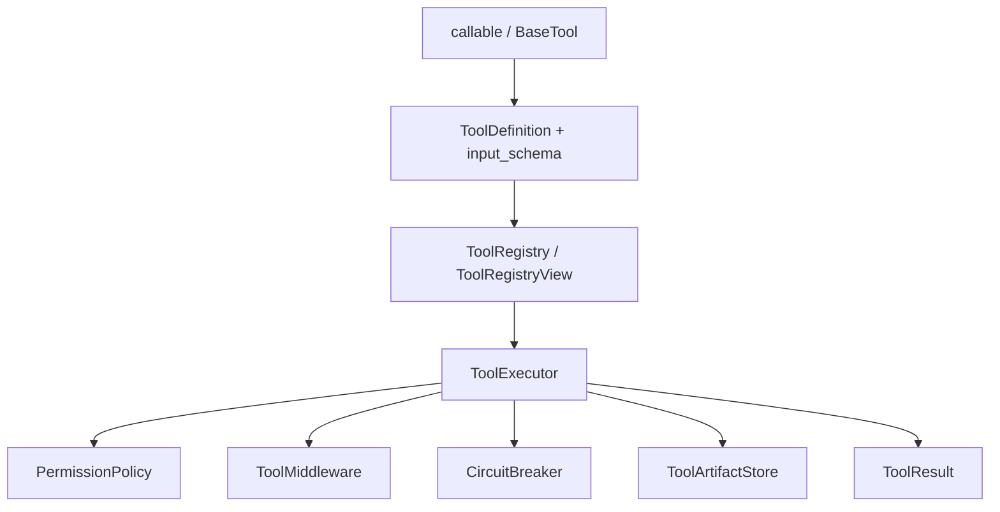
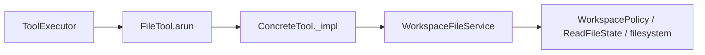

[中文](README.md)

# `iris.tools`

`iris.tools` is Iris's tool kernel. It adapts Python callables or `BaseTool` subclasses into
model-visible schemas and centralizes input validation, permission checks, execution, result
normalization, large-output artifacts, middleware, and circuit breaking.

## Architecture

Internal `subagent.py` defines the fixed `subagent(prompt, agent?)` schema and immutable routes.
`agent` selects an exact catalog key, defaulting to the catalog default; `prompt` is trimmed and
must be nonblank. `SubagentTool.execute_subagent()` returns `ToolResult | ChildWaiting` through
a narrow port. Direct `arun()` raises `IrisToolExecutionError`; ordinary `BaseTool.arun()` retains
its terminal `ToolResult` contract.

The default policy allows only the concrete builtin `SubagentTool`; other AGENT tools still need
human approval. Internal `MostRestrictivePermissionPolicy` evaluates both policies against each
actual child tool and selects the original decision by DENY > REQUIRE_HUMAN > ALLOW. Ties retain
the parent's reason/metadata.

The dedicated `ToolExecutor` Sub Agent path preserves raw input parsing, fresh permission refresh,
and final identity/artifact normalization. Linked continuation skips outer permission. ChildWaiting
returns directly, without middleware, breaker, parent claim, or ordinary timeout. Ordinary tools
still normalize and persist the final body after after_call. Controller lifecycle, persistence,
and recovery errors propagate unchanged. ACTIVE and WAITING share final normalization and
`ARTIFACT_ERROR` projection.



## Quick start

```python
from pathlib import Path

from iris.message import ToolUseBlock
from iris.tools import ToolExecutionContext, ToolExecutor, ToolRegistry, tool


registry = ToolRegistry()


@tool(registry=registry, description="Create a greeting")
def greet(name: str) -> str:
    return f"Hello, {name}"


executor = ToolExecutor(registry)

result = await executor.execute_one(
    ToolUseBlock(id="call_1", name="greet", input={"name": "Iris"}),
    ToolExecutionContext(workspace_root=Path(".")),
)
```

## Definitions, registry, and schemas

`ToolDefinition` holds the validated name, description, object JSON schema, capabilities, group,
aliases, deferred flag, output limits, `context_retention`, and metadata. `ToolExecutionContext` carries call, workspace,
session, agent, permission, metadata, shared read-state information, and a shared live
`cancellation` signal that serialization excludes. `ToolResult` is the single result boundary;
`model_content` produces model-facing text and `to_block_metadata()` keeps the supported metadata
subset. `to_msg()` projects this trusted result directly into a history message, without
normalizing metadata again. Runtime commits and terminal tool closure share this projection.

`ToolDefinition.context_retention` defaults to `"keep"`. Authors can explicitly choose
`"observation"` to let runtime shorten committed successful result bodies under request pressure,
while retaining the original through `context_read`. Built-in `read_file`, `list_files`, `grep_search`,
`web_search`, and `web_fetch` opt in. Write/edit tools, command execution, subagent final answers,
HITL, Skill bodies, and unknown custom tools keep the default. A READ capability alone does not
make a result eligible.

After execution, executor finalization stamps `context_retention` and canonical `context_tool_name`,
overriding same-named metadata supplied by the tool. History stores these facts in
`ToolResultBlock.metadata.extra`; recovery uses the saved declaration and name rather than the
current registry. Errors and unclosed calls are never reduced.

Retention changes only the model's history view. Identical arguments still cause a real execution;
only afterward can equal canonical names, normalized JSON arguments, and complete result bodies
allow older duplicates to be folded. Many distinct medium-sized results can instead be shortened
without any individual result reaching the artifact threshold. See
[runtime](../runtime/README.en.md#history-projection-and-summary-construction) for group protection,
budget checks, and read-availability requirements.

`BaseTool` defines `validate_input()`, read/destructive/concurrency classification, and async
`arun()`. `CallableTool` derives a schema from signatures, annotations, docstrings, or an explicit
Pydantic model and normalizes strings, `None`, JSON-compatible values, and exceptions. Synchronous
functions use `CallableExecutionMode.INLINE` by default, preserving the existing calling thread and
ordering. Only an explicit `THREAD` declaration runs the function in a worker thread. Async
functions cannot use `THREAD` and fail registration with `IrisToolValidationError`. If a synchronous
thread function returns an awaitable, Iris still awaits it on the event loop. Preset kwargs are
hidden from schema and callers cannot override them.

`THREAD` only selects execution placement through `asyncio.to_thread()`; `CallableTool.arun()`
does not independently consume `context.cancellation`. Direct `arun()` callers own cancellation
of their task. Through the executor, the executor translates the signal into body-task cancellation.

Each `CallableTool` uses one input model. Without an explicit `input_model`, Iris builds a
Pydantic model from the function annotations and docstring parameter descriptions. That model
owns both exported JSON Schema and first input validation, including fixed tuple positions,
`Annotated` constraints, nullable fields, and defaults. The callable receives validated fields
directly, preserving Python types such as tuples and nested `BaseModel` instances.

`schema_from_callable(func, preset_kwargs=...)` exports through the same dynamic model builder.
It requires resolvable annotations, supports ordinary and keyword-only parameters, and skips
`*args`/`**kwargs`. `schema_from_pydantic_model(model)` returns the complete model JSON Schema,
including `$defs` and root constraints such as `additionalProperties`.

`ToolRegistry` registers tools/functions, resolves names and aliases, creates filtered views, exports
active schemas, and searches deferred definitions. Deny filters override allow filters. Deferred
tools are hidden unless explicitly allowed. Schema helpers support Iris-native, OpenAI Chat,
OpenAI Responses, and Anthropic wrapper shapes; runtime's active provider path currently mounts the
OpenAI Chat shape.
`ToolRegistryView.available_tools` includes deferred definitions within the same static filters;
only the host's original `allow` can bypass a group filter. `schemas_for(names)` exports complete
Chat schemas for selected canonical names in registration order without changing the shared view.
`search_deferred(query, include_groups=None, limit=10, allowed_names=None)` filters before ranking
and applying the limit.

Name-conflict checks use the registry's existing name and alias indexes directly instead of
revisiting every registered tool definition.

`@tool` attaches metadata without wrapping the function. Passing `registry` immediately calls that
registry's `register_function()`; omitting it leaves registration to config assembly or a later
explicit call. Schema extraction supports the documented Python/Pydantic types and Google-style
docstring argument descriptions. Unsupported parameter types produce validation errors.

## Execution and HITL preflight

`execute_one()` always returns `ToolResult`, mapping not-found, validation, permission, execution,
middleware, and open-circuit failures to stable error codes. `execute_many()` runs consecutive
read-only concurrency-safe calls concurrently and serializes writes or unsafe calls while preserving
result order and shared file read state. Classification failure conservatively falls back to serial.

`register(tool)` adds a `BaseTool` and raises a validation error on name or alias conflicts.
`prepare_many()` performs registry lookup, input-schema validation, and the initial policy check
without running middleware, the breaker, artifact persistence, or tool side effects. Each
`PreparedToolCall` retains both typed `validated_input` and normalized `arguments`. Runtime reuses
that plan for the complete tool batch. `execute_prepared()` refreshes permission only; it does not
repeat registry lookup, schema validation, or a typed-model-to-dict round trip. It accepts approval
only for the exact tool-call ID and optionally accepts a `ToolEffectGuard`. Historical approval
never overrides current deny, workspace, or stale-read checks.

Custom permission policies implement `PermissionPolicy.check(tool, params, context)`.

Preflight precedence is: deny returns `PERMISSION_ERROR`; a human tool under allow creates its own
question; a human tool under require-human fails closed to prevent nested gates; only an ordinary
require-human call creates a permission prompt.

After approval, execution checks the circuit breaker, cancellation, the effect guard, and
cancellation again before entering middleware `before_call`, a pre-body cancellation check, tool
`arun`, middleware after hooks, artifact handling, and breaker accounting. A guard failure starts
no tool effect. Cancellation after a claim propagates as control flow to runtime instead of becoming
a normal tool error.
Low-level executor callers may omit the guard; lifecycle execution requires it through
`ToolBridge`. Parallel context copies deep-copy only the isolated `metadata`; typed
`ReadFileState` and cancellation are shared directly without copying their objects or records.
`ToolExecutionContext` parses read state at its public raw-input boundary; file
services consume the typed object directly without repeating type checks.

The executor performs artifact handling once after every `after_call` hook. Hooks receive the full
tool result; expanded final content is therefore also subject to `max_result_chars`.
Cooperative cancellation uses `IrisCancellationRequestedError` from `iris.exceptions`, and
`CallableTool` propagates it instead of normalizing it as an ordinary tool error.

`ToolExecutor` is the sole owner of translating a signal into cancellation and draining of an
ordinary `arun()` body task, covering async callables, custom async `BaseTool` implementations, and
THREAD callables. Without a signal it awaits the body directly; with a signal it checks body
completion before cancellation. A completed result wins. If the executor cancels the body because
of the signal and the body catches `CancelledError` and returns normally, its `ToolResult` is kept.
If external `Task.cancel()`, timeout, or runtime sibling cancellation has already interrupted the
executor, it drains the body and keeps a normal return for ordered durable commit. Runtime then
propagates the pending cancellation or settles the recorded timeout; a known result does not clear
the interruption. A genuinely cancelled body or unknown exception keeps the existing control path.

This cancellation bridge covers only the body. A pending request after `before_call` prevents body
startup; once the body returns, `after_call`, artifact handling, and breaker accounting continue.
Slow middleware, coroutines that suppress `CancelledError`, and INLINE blocking can still delay
exit. Cancellation of a custom THREAD callable ends only its async waiter; the worker may continue. Unresolved claims
still settle as `OUTCOME_UNKNOWN`, including read-only calls, and late returns cannot change the
durable result.

The blocking I/O in `read_file`, `list_files`, `grep_search`, `write_file`, and `edit_file` runs in
worker threads. Writes and edits use a snapshot of the existing immutable read records, complete
the checks, write, and stat in one job, then return a `ReadFileRecord` for loop-side merge. Workers
never mutate shared `ReadFileState`; a failed operation does not merge or replace other records.
The synchronous `WorkspaceFileService` methods remain available for direct callers.

Final result normalization, serialization, and artifact writing also run in a worker. These finite
local operations drain through repeated cancellation to recover their actual result or error. They
use the existing thread pool, with no new persistent worker or registry. This does not change direct
`CallableTool.arun()` THREAD cancellation or make remote requests non-cancellable.

`WorkspaceFileService.read_text_observed()` supplies complete text and a file observation from one
open file for Skill loading, sharing the workspace and regular-file boundaries.
It does not update shared read state; callers merge after a successful await. Ordinary
`read_file_observed(..., max_chars=...)` reads only the budgeted page plus one lookahead character.
Skipping preceding lines and columns is also chunked, without loading an entire long line.

`ToolExecutor` provides classification, permission refresh, and per-call execution primitives only. The
lifecycle active path layers a fixed internal runtime window bound of 8 over those primitives.
Only consecutive read-only and concurrency-safe calls can enter a window; STOP, HITL, preflight
results, and unsafe calls remain barriers. Every call keeps its own durable claim. Body completion
does not determine result order, and claim telemetry order is not an ordinal contract. Undeclared
synchronous callables remain inline and may block the event loop; explicit `THREAD` placement
isolates blocking waits but does not promise CPU speedup. Placement does not enter provider schemas.
Future
NETWORK/MCP or write concurrency must define a new effect and recovery protocol rather than merely
changing the capability classifier.

## Built-in file tools

When a memory service supplies a file view, Agent assembly binds the formal Markdown paths for
`read_namespaces` to `WorkspaceFileService(memory_view=...)`. Direct access and recursive traversal
inside that memory root use only the permitted namespaces' formal projections; legacy mixed files
and the database are outside this file view. Read and grep check the consumed source revision
against state observed after reading and include stale warnings, including grep with no matches.
Missing formal files still report `FILE_NOT_FOUND` with their projection status. Projected content
can be read; changes go through memory write tools or the SDK. Without a memory service, or with an
independent SDK service without a mirror, no memory file view is bound. When `memory.enabled` is on,
SQLite services constructed from configuration provide a mirror. Ordinary workspace files keep the existing rules.
The model's `memory_search` / `memory_fetch` tools read SQLite directly and do not depend on projections.

The Agent's memory switch automatically registers these two reads; memory writes remain explicit.
Standalone SDK `register_memory_tools()` still defaults to an empty selection; see
[memory](../memory/README.en.md).

`register_file_tools()` registers, in stable order, `read_file`, `list_files`, `grep_search`,
`write_file`, and `edit_file`, injecting one shared `WorkspaceFileService`.



- reads preserve decoded newlines, may include `L0001 |` line numbers, and update `ReadFileState`
  through loop-side observation merge;
- list uses streaming `os.scandir` discovery order and does not guarantee global lexicographic
  order; list patterns retain `Path.rglob()` recursion semantics, including `**` matching zero or
  more directory segments; grep reads UTF-8 files line by line and skips `.iris` before descent
  unless the explicitly requested path is inside `.iris`;
- list/grep stop as soon as the global `max_results` limit is reached, and `max_results=0` performs
  no path resolution, walk, stat, or open;
- with `max_results > 0`, a missing list/grep root raises `FILE_NOT_FOUND`;
- recursive file discovery skips escaping symlinks and grep skips decoding failures;
- overwriting/editing an existing file requires a prior unchanged read;
- edit requires exactly one match;
- resolved parent/symlink escapes are rejected;
- successful paths use workspace-relative `/` separators.

`ReadFileInput` uses zero-based line `offset` and Unicode character `column` within that line.
`limit` defaults to 1000 lines and accepts 0..1000. The tool budgets source text, optional line
numbers, and a model-visible footer together:

```text
[read_file: offset=0, column=0; next_offset=0, next_column=800; has_more=true]
```

When has_more is true, pass next_offset/next_column as the next request's offset/column with the
same file path. False means EOF. Coordinates count source characters, excluding line-number
prefixes; consuming a newline advances offset and resets column. Long lines are split without
creating another artifact during ordinary paging. Page text retains trailing newlines. limit=0
only reports remaining content without consuming source text; no total-line scan is performed.
An invalid starting column returns COLUMN_OUT_OF_RANGE. An insufficient page budget returns
READ_BUDGET_TOO_SMALL. Direct service read_file/read_file_observed calls require max_chars.

Large execution output, including errors, is stored at
`.iris/tool-results/{encoded_session_id}/{encoded_call_id}-{random_id}.txt`, and the result becomes a preview
plus artifact metadata. Each ID segment is `id_` followed by its complete UTF-8 bytes encoded as
lowercase hexadecimal; an empty ID becomes `id_`. Distinct IDs retain distinct paths even on
case-insensitive filesystems. Every write adds a random identifier, so reusing a call ID within a
session does not overwrite an earlier result. Containment is still checked when writing. Recovery
and forks reuse the saved immutable paths without copying or rewriting payloads.
Default permissions do not
directly allow writes; configure `DefaultPermissionPolicy(write_mode="allow")` or let runtime host
the confirmation gate.

`persist_json()` stores complete parsed MCP JSON; `artifact_store_for()` selects the store for
the current context.session_id. Oversized final `model_content` is saved after all middleware.
Plain text uses one `.txt` file, with `ToolArtifact.text_path == path`. When a native artifact already
exists, its `path` is preserved and a separate `.model.txt` file supplies `text_path`; the raw payload
cannot replace the text produced by middleware. Results within the limit need no additional text file.

Successes, returned errors, raised tool exceptions, and middleware errors share the final output
handling. The budget includes the error prefix and retrieval notice; `error.message` retains the
preview and path. If the notice and prefix alone exceed the budget, finalization returns
`ARTIFACT_ERROR` rather than emitting an incomplete reference or exceeding the character limit.
Preflight errors are clipped without writing files.

`ToolDefinition.preview_chars` is the sole preview setting; `ToolExecutor` no longer accepts
`artifact_preview_chars`. An artifact write failure returns an error without retrying the write.
The [MCP adapter](../mcp/README.en.md) uses the ordinary executor and cancellation bridge.
Default permissions allow only locally trusted read-only MCP tools.
`IrisMCPOutcomeUnknownError` bypasses both exception conversions for existing runtime settlement.

## Current-session context reads

With the default `context_policy.enabled: true`, `AgentRunner` registers `context_read` and
`context_search` automatically. Neither belongs in `tools.builtin`, and neither requires memory or
`file.read`. The tools delegate through [`ContextAccessPort`](context_access.py), using the current
`ToolExecutionContext.session_id`; the model supplies neither a session ID nor an arbitrary file path.

| Tool | Parameters | Result and scope |
| --- | --- | --- |
| `context_read` | `ref`; `offset=0`; `limit=4000` (1..8000); `representation="text"` or `"raw"` | A saved text page; `ToolResult.data` contains `ref/representation/offset/next_offset/has_more/content` |
| `context_search` | Nonblank `query`; `after=0`; `limit=10` (1..20) | Unicode casefold substring search over committed text and tool previews in the current session; returns `matches/next_after/has_more` |

`message:<index>` names an original message; `result:<message_index>:<block_index>` names a tool
result block. Both indices are zero-based and are not renumbered by summary projection. Result
`text` reads the complete model text before final truncation, using `artifact.text_path` when
present or the archived body otherwise. Result `raw` requires an artifact and reads the native file
as text, such as MCP JSON. A message's text representation includes its role, sender, and block
boundaries.
Use the default `text` to recall ordinary historical content. Inline results and message references
have no `raw` representation; the tool parameter description makes this distinction explicit.

Read offsets and limits count Python Unicode characters. The page and short continuation header
share a 12,000-character tool limit, avoiding another offload during ordinary paging. After hooks
still apply; exact page reconstruction assumes middleware does not rewrite the returned body.
Unavailable files or invalid references return `CONTEXT_SOURCE_UNAVAILABLE`; an unavailable raw
representation returns `CONTEXT_REPRESENTATION_UNAVAILABLE`. Reads never rerun the source tool or
substitute current file contents for its saved result.

Search scans at most 200 messages per call, returning at most one match per message and a snippet
of at most 240 characters. It does not scan complete offloaded artifacts. A page with no matches
can still have `has_more=true`; continue from `next_after`. Matches carry exact refs for later
reads. Each complete read or search operation runs in one IO worker.

## Human tool, middleware, breaker, and discovery

`ToolRegistry.register_many(tools)` checks names and aliases against both the batch and existing
indexes before publishing. Conflicts leave the registry unchanged. `register(tool)` uses the same
admission path, and existing views see the published tools.

YAML name `human.ask` registers model-visible `ask_question`. `AskQuestionTool` converts validated
input to `QuestionPrompt` and refuses direct `arun()`; runtime owns the interaction.

`ToolMiddleware` defines exact async `before_call`, `after_call`, and `on_error` hooks. Custom
middleware subclasses it and overrides the required hooks; the executor does not probe partial
objects, synchronous returns, or legacy hooks. Middleware failures become `MIDDLEWARE_ERROR`.
`CircuitBreaker` tracks consecutive failures by tool name and returns
`CIRCUIT_OPEN` during cooldown.

`DeferredToolIndex` uses a local BM25-like ranker over name, tags, group, and description, with CJK
bigrams, low-weight single characters, query coverage, and stable sorting. Construct `ToolSearchTool`
with a static `ToolRegistryView`, for example `ToolSearchTool(registry.view())`. Its model-facing name
is `tool_search`; `ToolSearchInput(query, include_groups=None, limit=3)` permits limits from 1 to 20.
The lower-level registry search still defaults to 10. Base deny/group/allow and query group filters
apply before ranking and top-k; search results cannot expand the host's group scope.

JSON text and `data["tools"]` contain candidate summaries with `name`, `description` capped at 240
characters, and `group`. No matches return an empty list; full schemas stay out of search text.
A successful system search saves ranked canonical names in the committed tool message's
`metadata.extra.context_revealed_tools`. Executor does not accept this field from other tools as a
disclosure fact. Names come from the successful search body and survive an after-middleware text
replacement; final errors and successful on_error substitutes do not create disclosure.

Search alone does not mutate the registry. With `context_policy.deferred_tools: true`, runtime
registers the tool automatically and selects complete candidate schemas for the next main model
request only after the search result commits to that session's history. Newly found tools cannot
be used in the same batch as their discovery call; the model waits for an actual schema in the next
request. See [runtime](../runtime/README.en.md#deferred-tool-schemas) for budgets, forced tools,
and batch recovery.

## Public surface and boundaries

The exact top-level API is `src/iris/tools/__init__.py::__all__`, including
`CallableExecutionMode`, and covering models, base/adapters,
registry/view, executor/preflight, permission/artifact/middleware/breaker types, file/human tools,
deferred discovery, schema helpers, and `tool`. Protected `_impl()` hooks and executor private
lifecycle methods are internal.

The package does not run provider loops, persist ordinary session data, or render host UI.
MCP protocol integration lives in `iris.mcp` and uses this package's ordinary tool contracts.

## Maintenance

| Change | Main location | Tests |
| --- | --- | --- |
| Models, callable/schema adaptation, and registration | `base.py`, `schema.py`, `registry.py` | `tests/tools/test_schema.py`, `tests/tools/test_registry.py`, `tests/tools/test_executor.py` |
| Lifecycle and HITL preflight | `executor.py`, `permissions.py` | `tests/tools/test_executor.py`, `tests/tools/test_executor_preflight.py`, `tests/tools/test_human_ask_tool.py` |
| File tools, artifacts, and workspace safety | `builtin/file.py`, `artifacts.py` | `tests/tools/test_file_tools.py` |
| Complete-result storage and current-session reads | `artifacts.py`, `context_access.py`, `../harness/_context_access.py` | `tests/tools/test_middleware_artifact.py`, `tests/harness/test_context_access.py`, `tests/store/test_lifecycle_store_contract.py` |
| Retention declarations and execution-time facts | `base.py`, `executor.py`, `builtin/file.py`, `builtin/web.py` | `tests/tools/test_context_retention.py` |
| Deferred search, static filters, and disclosure facts | `discovery.py`, `registry.py`, `executor.py` | `tests/tools/test_deferred_discovery.py` |
| Circuit breaker | `circuit.py` | `tests/tools/test_circuit_breaker.py` |

```bash
uv run pytest tests/tools
uv run ruff check src/iris/tools tests/tools
```
