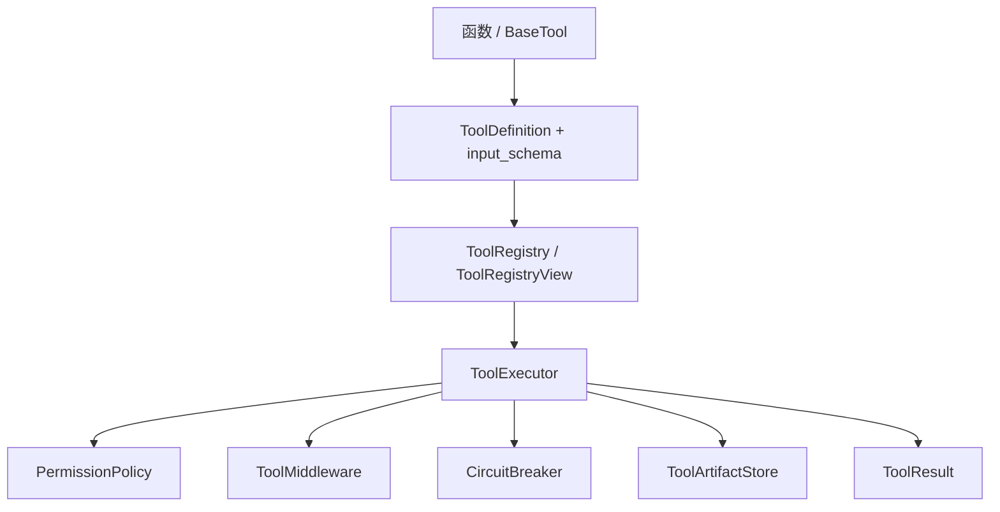
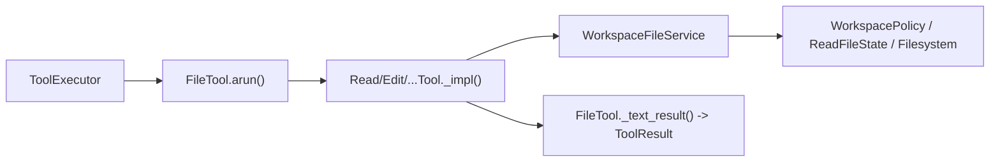

# iris.tools

`iris.tools` 是 Iris 的工具内核，负责把 Python 函数或 `BaseTool` 子类包装成模型可见的工具 schema，并在执行时统一处理参数校验、权限、结果归一化、超长输出落盘、middleware 和熔断。

本文只覆盖 `src/iris/tools` 当前代码中的公共 API。常用导入路径为：

```python
from iris.tools import ToolRegistry, ToolExecutor, ToolExecutionContext, tool
```

## 架构



核心流程：

1. 用 `CallableTool`、`ToolRegistry.register_function()` 或自定义 `BaseTool` 生成 `ToolDefinition`。
2. `ToolRegistry` 管理工具名称、别名、分组、deferred 可见性，并导出 provider schema。
3. `ToolExecutor` 接收 `iris.message.ToolUseBlock`，查找工具、校验输入、检查权限、执行工具、运行 middleware，并返回 `ToolResult`。
4. 超过 `ToolDefinition.max_result_chars` 的非错误文本结果会由 `ToolArtifactStore` 写入 `.iris/tool-results/{session_id}/{call_id}.txt`，返回预览和 artifact 元数据。

## 快速入门

```python
from pathlib import Path

from iris.message import ToolUseBlock
from iris.tools import ToolExecutionContext, ToolExecutor, ToolRegistry, tool


@tool(description="生成问候语")
def greet(name: str) -> str:
    return f"你好，{name}"


registry = ToolRegistry()
registry.register_function(greet)
executor = ToolExecutor(registry)

result = await executor.execute_one(
    ToolUseBlock(id="call_1", name="greet", input={"name": "Iris"}),
    ToolExecutionContext(workspace_root=Path(".")),
)

assert result.model_content == "你好，Iris"
```

## 核心定义

### 工具模型

- `ToolCapability`: 能力标签，包含 `READ`、`WRITE`、`EXECUTE`、`NETWORK`、`MCP`、`AGENT`。
- `ToolExecutionMode`: 执行模式枚举，包含 `SYNC`、`ASYNC`、`STREAM`。
- `ToolDefinition`: 工具元数据，字段包括 `name`、`description`、`input_schema`、`capabilities`、`group`、`aliases`、`deferred`、`max_result_chars`、`preview_chars`、`metadata`。
- `ToolExecutionContext`: 单次调用上下文，包含 `call_id`、`tool_name`、`workspace_root`、`session_id`、`agent_id`、`permission_mode`、`metadata`、`read_state`。
- `ToolResult`: 统一工具结果，包含 `content`、`is_error`、`error`、`data`、`artifact`、`stats`、`metadata`；`model_content` 返回可回灌模型的文本。
- `ToolErrorInfo`: 结构化错误，包含 `code`、`message`、`retryable`、`details`。
- `ToolArtifact`: 超长结果或文件类产物引用，包含 `path`、`mime_type`、`size_bytes`、`preview`。

### BaseTool 与 CallableTool

`BaseTool` 是所有工具的接口：

- `name`: 来自 `definition.name`。
- `input_model`: 默认 `None`，子类可返回 Pydantic 输入模型。
- `input_schema`: 来自 `definition.input_schema`。
- `validate_input(params)`: 默认原样返回；失败时应抛出工具校验异常。
- `is_read_only(params)`: 没有写入、执行、网络、MCP、Agent 能力时为只读。
- `is_destructive(params)`: 具有 `WRITE` 或 `EXECUTE` 时为破坏性。
- `is_concurrency_safe(params)`: 默认 `True`。
- `async arun(params, context)`: 子类必须实现，返回 `ToolResult`。

`CallableTool` 将普通 callable 适配为 `BaseTool`。它会从函数签名、类型注解、docstring 或显式 `input_model` 生成 schema，并把返回值归一化为 `ToolResult`：字符串直接作为文本，`None` 为空内容，其他值优先 JSON 序列化。

`preset_kwargs` 会在执行前注入函数调用，但不会暴露在 schema 中；调用方若传入同名参数会得到校验错误。

## 注册与执行

### ToolRegistry

```python
registry = ToolRegistry()
tool_obj = registry.register_function(
    greet,
    description="生成问候语",
    group="core",
    deferred=False,
)
```

公共方法：

- `register(tool, on_conflict="raise")`: 注册 `BaseTool` 实例；当前只支持 `raise` 冲突策略。
- `register_function(func, ...)`: 创建 `CallableTool` 并注册，支持 `name`、`description`、`input_model`、`capabilities`、`group`、`deferred`、`preset_kwargs`、`examples`、`tags`、`version`、`deprecated`、`deprecation_message`。
- `get(name)`: 按主名称或别名获取工具，未找到时抛出工具不存在错误。
- `view(include_groups=None, allow=None, deny=None)`: 创建只读过滤视图。
- `active_schemas(provider=None, api_style=None)`: 导出当前活动工具 schema。
- `search_deferred(query, include_groups=None, limit=10)`: 搜索 deferred 工具定义。

`ToolRegistryView.active_tools` 会隐藏 `deferred=True` 的工具，除非名称在 `allow` 中；`deny` 优先级高于 `allow`。`include_groups` 可按 `definition.group` 过滤。

`active_schemas()` 支持的 provider 包装：

- 默认：`{"name", "description", "input_schema"}`
- `provider="openai", api_style="chat"`: OpenAI Chat Completions function schema
- `provider="openai", api_style="responses"`: OpenAI Responses function schema
- `provider="anthropic"`: Anthropic Messages tool schema

### ToolExecutor

```python
executor = ToolExecutor(
    registry,
    permission_policy=DefaultPermissionPolicy(allow_writes=False),
    middleware=[],
    circuit_breaker=None,
)
```

公共方法：

- `execute_one(tool_use, context)`: 执行单个 `ToolUseBlock`，始终返回 `ToolResult`，常见错误码包括 `NOT_FOUND`、`VALIDATION_ERROR`、`PERMISSION_ERROR`、`EXECUTION_ERROR`、`MIDDLEWARE_ERROR`、`CIRCUIT_OPEN`。
- `execute_many(tool_uses, context)`: 连续只读且并发安全的调用会并发执行；遇到写入或非并发安全工具时按顺序执行。

执行顺序是：设置 context → 查 registry → circuit breaker `before_call` → 输入校验 → middleware `before_call` → 权限检查 → `tool.arun()` → middleware `on_error` 或 `after_call`/`after_execute` → artifact 处理 → circuit breaker 记录结果。

## 文件工具

文件工具位于 `iris.tools.builtin.file`，也从 `iris.tools` 顶层导出输入模型、`FileTool`、`WorkspaceFileService`、`FILE_TOOL_CLASSES` 和 `register_file_tools()`。

```python
from iris.tools import (
    DefaultPermissionPolicy,
    ToolExecutor,
    register_file_tools,
)

registry = register_file_tools(max_result_chars=50000)
executor = ToolExecutor(
    registry,
    permission_policy=DefaultPermissionPolicy(allow_writes=True),
)
```

内置工具按稳定顺序注册：

| 工具名 | 输入模型 | 能力 | 行为 |
| --- | --- | --- | --- |
| `read_file` | `ReadFileInput` | `READ` | 读取 workspace 内文本文件，返回 1 基行号，并记录 `ReadFileState` |
| `list_files` | `ListFilesInput` | `READ` | 列出 workspace 内普通文件路径 |
| `grep_search` | `GrepSearchInput` | `READ` | 用 Python 正则搜索 workspace 内 UTF-8 文本文件，跳过 `.iris` 和二进制解码失败文件 |
| `write_file` | `WriteFileInput` | `WRITE` | 写入新文件；覆盖已有文件前要求已读且未变化 |
| `edit_file` | `EditFileInput` | `WRITE` | 对已读且未变化的文件执行唯一字符串替换 |

### 文件工具的分层设计

文件工具不是把每个操作都实现成一个完整的 `BaseTool` 子类，而是把“执行协议”和
“文件业务”拆开。`FileTool` 固定 Iris 工具协议的共同部分，具体工具只在受保护的
`_impl()` 钩子中声明自身差异：



职责划分如下：

- `FileTool`: 创建 `ToolDefinition`、从输入模型生成 schema、统一参数模型转换，并将
  `arun()` 委派给 `_impl()`；具体文件工具无需重复协议包装代码。
- `ReadFileTool` / `WriteFileTool` 等具体工具：声明 `name`、`description`、
  `input_type`、`capabilities`，并在 `_impl()` 中将已校验参数转给文件服务、包装结果。
- `WorkspaceFileService`: 处理实际文件规则，包括 workspace 路径约束、读后写状态记录、
  stale 检查、符号链接边界、原子写入和具体文件操作。
- `register_file_tools()`: 为全部具体工具注入同一个 `WorkspaceFileService`，使同一
  registry 中的路径策略和读取状态语义保持一致。

这种拆分让工具的模型可见协议稳定，而文件安全规则集中在服务层维护。新增同类文件工具时，
通常只需新增输入模型、声明工具元数据并实现 `_impl()`；如果需要改变权限、middleware、
artifact 或熔断生命周期，应修改 `ToolExecutor` 对应扩展点，而不是把跨工具职责写入
`_impl()` 或 `WorkspaceFileService`。

输入约束：

- `ReadFileInput(file_path, offset=None, limit=None)`: `offset`/`limit` 非负，`limit <= 1000`。
- `ListFilesInput(path=".", pattern=None, max_results=200)`: `max_results` 范围为 `0..1000`。
- `GrepSearchInput(pattern, path=".", max_results=200)`: `max_results` 范围为 `0..1000`；无效正则会校验失败。
- `WriteFileInput(file_path, content)`。
- `EditFileInput(file_path, old_string, new_string)`: `old_string` 不能为空，且必须唯一匹配。

`WorkspacePolicy.resolve_path()` 会拒绝 workspace 外路径，包括父目录逃逸和解析后逃逸的符号链接。`WorkspaceFileService` 用 `ReadFileState` 记录文件的 `mtime_ns` 和 `size_bytes`，写入或编辑已有文件前会检查 `FILE_NOT_READ` 和 `STALE_FILE_STATE`。

文件写入成功返回的 workspace 相对路径统一使用 `/` 分隔，避免不同操作系统返回不同格式。

默认权限策略不会直接允许写工具。使用文件写入/编辑时，需要给 `ToolExecutor` 传入允许写入的策略，例如 `DefaultPermissionPolicy(allow_writes=True)`。

## 权限、artifact、middleware、熔断

### 权限

- `PermissionDecision(allowed, reason="", require_confirmation=False, metadata={})`: 权限裁决结果；拒绝时必须有 `reason`。
- `PermissionPolicy.check(tool, params, context)`: 权限策略接口。
- `DefaultPermissionPolicy(allow_writes=False)`: 只读工具默认允许；写入工具默认拒绝并返回 `require_confirmation=True`；`allow_writes=True` 时允许只包含 `READ`/`WRITE` 能力的工具。
- `WorkspacePolicy`: 路径边界策略，用于文件工具。
- `ReadFileState` / `ReadFileRecord`: 文件读后写入的乐观锁状态。

### Artifact

`ToolArtifactStore.persist_if_large(result, max_chars=...)` 只处理非错误结果。若 `result.model_content` 超过阈值，会写入本地文本 artifact，并把返回内容替换为预览、完整路径和 `.iris/` gitignore 提示。

### Middleware

`ToolMiddleware` 提供生命周期钩子：

- `before_call(tool, params, context) -> None`
- `after_call(tool, result, context) -> ToolResult`
- `on_error(tool, error, context) -> ToolResult | None`
- `after_execute(result, context) -> ToolResult`，用于兼容旧式执行后钩子

`ToolExecutor` 也接受只实现部分同名方法的对象；middleware 抛错会变成 `MIDDLEWARE_ERROR`。

### CircuitBreaker

`CircuitBreaker(failure_threshold=3, cooldown_seconds=30.0)` 按工具名记录连续错误：

- `before_call(tool_name)`: 熔断打开且未过冷却期时抛出工具执行错误，executor 映射为 `CIRCUIT_OPEN`。
- `after_result(tool_name, result)`: 成功时 reset，错误时增加失败计数，达到阈值后打开熔断。
- `reset(tool_name)`: 清除指定工具状态。

## Deferred discovery / tool_search

`deferred=True` 的工具默认不会出现在 `active_schemas()` 中，适合注册表内存在大量按需工具时降低模型可见面。

`registry.search_deferred()` 使用 `DeferredToolIndex.search()` 的 BM25-like 本地排序：
它会对 `name`、`tags`、`group`、`description` 分字段加权，使用 IDF、词频饱和和文档长度归一化计算相关性。
中文文本会额外生成 CJK bigram 和低权重单字 token，并按查询词覆盖率加分，避免只命中单个高权重字段的工具压过同时覆盖多个中文查询词的工具。
旧的字符子串硬匹配保留为 `DeferredToolIndex.naive_search()`，主要用于调试和对照测试。

```python
from iris.tools import ToolRegistry, ToolSearchTool, tool


@tool(deferred=True, tags=["embedding"], group="research")
def vector_lookup(query: str) -> str:
    """检索向量知识库。"""
    return query


registry = ToolRegistry()
registry.register_function(vector_lookup)
registry.register(ToolSearchTool(registry))
```

`ToolSearchTool` 的工具名固定为 `tool_search`，输入模型为 `ToolSearchInput(query, include_groups=None, limit=10)`。它调用 `registry.search_deferred()`，按名称、描述、组和 tags 做 BM25-like 本地排序，返回 JSON 文本和 `data["tools"]` 摘要；它不会自动激活匹配到的 deferred 工具。

## Schema 与装饰器

### `@tool`

`tool(...)` 只给函数附加 `iris_tool_` 元数据，不自动注册，也不改变函数引用。`ToolRegistry.register_function()` / `CallableTool` 会读取这些元数据。

支持参数：`name`、`description`、`capabilities`、`group`、`deferred`、`preset_kwargs`、`examples`、`tags`、`version`、`deprecated`、`deprecation_message`。

### schema helpers

- `DocstringSchemaExtractor.extract(func)`: 解析 Google Style docstring 的 summary、Args、Returns、Example/Examples。
- `schema_from_callable(func, preset_kwargs=...)`: 从函数签名、类型注解和 docstring Args 生成 object JSON Schema；函数参数必须有可解析类型注解，支持普通参数和 keyword-only 参数，跳过 `*args`/`**kwargs`。
- `schema_from_pydantic_model(model)`: 从 Pydantic 模型生成最小 object schema，并保留 `$defs`。
- `to_openai_chat_tool_schema(definition)`、`to_openai_responses_tool_schema(definition)`、`to_anthropic_tool_schema(definition)`: 将 `ToolDefinition` 包装为 provider 需要的 schema 形状。

常见类型映射包括 `str`、`int`、`float`、`bool`、`list`、`set`、`tuple`、`dict`、`Literal`、`Union`/`|`、`Any` 和嵌套 `BaseModel`。不支持的参数类型会触发工具校验错误。

## 顶层导出

`iris.tools.__all__` 当前导出：

```text
BaseTool, CallableTool, CircuitBreaker, CircuitBreakerState,
DeferredToolIndex, DocstringInfo, DocstringSchemaExtractor,
DefaultPermissionPolicy, EditFileInput, FILE_TOOL_CLASSES, FileTool,
GrepSearchInput, ListFilesInput, PermissionDecision, PermissionPolicy,
ReadFileInput, ReadFileRecord, ReadFileState, ToolArtifact,
ToolArtifactStore, ToolCapability, ToolDefinition, ToolErrorInfo,
ToolExecutionContext, ToolExecutionMode, ToolExecutor, ToolMiddleware,
ToolRegistry, ToolRegistryView, ToolResult, ToolSearchInput,
ToolSearchTool, WorkspaceFileService, WorkspacePolicy, WriteFileInput,
register_file_tools, schema_from_callable, schema_from_pydantic_model,
to_anthropic_tool_schema, to_openai_chat_tool_schema,
to_openai_responses_tool_schema, tool
```
