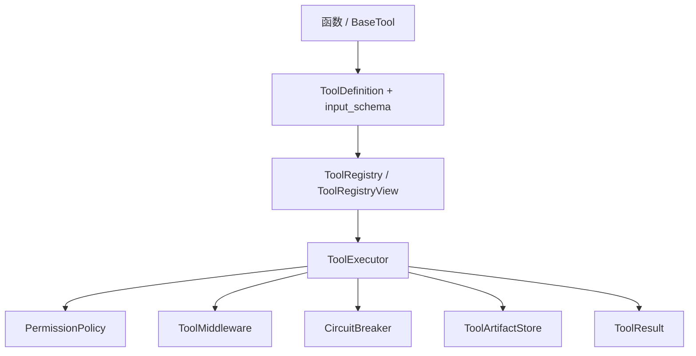
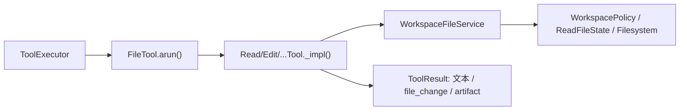

[English](README.en.md)

# `iris.tools`

`iris.tools` 是 Iris 的工具内核，负责把 Python 函数或 `BaseTool` 子类包装成模型可见的逻辑工具定义，并在执行时统一处理参数校验、权限、结果归一化、超长输出落盘、middleware 和熔断。

本文只覆盖 `src/iris/tools` 当前代码中的公共 API。常用导入路径为：

```python
from iris.tools import ToolRegistry, ToolExecutor, ToolExecutionContext, tool
```

## 架构

内部 `subagent.py` 定义固定的 `subagent(prompt, agent?)` schema 和只读路由投影。
`agent` 按 catalog exact selector 选择，省略时使用 default；`prompt` trim 后必须非空。
`SubagentTool.execute_subagent()` 通过窄 port 返回 `ToolResult | ChildWaiting`；
直接 `arun()` 抛 `IrisToolExecutionError`。普通 `BaseTool.arun()` 的返回契约不变。

默认策略对具体内置 `SubagentTool`、`WebSearchTool`、`WebFetchTool` 返回 ALLOW，
其他 AGENT/NETWORK 工具仍要求人工确认。
内部 `MostRestrictivePermissionPolicy` 对真实 child 工具分别调用父子策略，按
DENY > REQUIRE_HUMAN > ALLOW 取原始决策；同级保留 parent 的 reason/metadata。

`ToolExecutor` 的专用 Sub Agent 入口保留 raw 参数解析、fresh permission refresh 与最终
identity/artifact 归一化；linked continuation 跳过 outer permission。ChildWaiting 直接返回，
不进入 middleware、breaker、parent claim 或普通 timeout。普通工具在包装链返回后归一化
最终正文并落盘。ACTIVE/WAITING 共用最终归一化与 `ARTIFACT_ERROR` 投影。
Controller 的 lifecycle/persistence/recovery 异常原样传播。


```mermaid
graph TD
    A["函数 / BaseTool"] --> B["ToolDefinition + input_schema"]
    B --> C["ToolRegistry / ToolRegistryView"]
    C --> D["ToolExecutor"]
    D --> E["PermissionPolicy"]
    D --> F["ToolMiddleware"]
    D --> G["CircuitBreaker"]
    D --> H["ToolArtifactStore"]
    D --> I["ToolResult"]
```

核心流程：

1. 用 `CallableTool`、`ToolRegistry.register_function()` 或自定义 `BaseTool` 生成 `ToolDefinition`。
2. `ToolRegistry` 管理工具名称、别名、分组、deferred 可见性，并导出模型可见的逻辑 `ToolSpec`。
3. `ToolExecutor` 接收 `iris.message.ToolUseBlock`，查找工具、校验输入、检查权限、执行工具、运行 middleware，并返回 `ToolResult`。
4. 超过 `ToolDefinition.max_result_chars` 的执行结果（含错误）会由 `ToolArtifactStore` 写入 `.iris/tool-results/{encoded_session_id}/{encoded_call_id}-{随机标识}.txt`，返回预览和 artifact 元数据。预检短路错误只裁剪说明，不写入文件。

## 快速入门

```python
from pathlib import Path

from iris.message import ToolUseBlock
from iris.tools import ToolExecutionContext, ToolExecutor, ToolRegistry, tool


registry = ToolRegistry()


@tool(registry=registry, description="生成问候语")
def greet(name: str) -> str:
    return f"你好，{name}"


executor = ToolExecutor(registry)

result = await executor.execute_one(
    ToolUseBlock(id="call_1", name="greet", input={"name": "Iris"}),
    ToolExecutionContext(workspace_root=Path(".")),
)

assert result.model_content == "你好，Iris"
```

## 工具图片导入

普通工具可调用 `import_tool_image(source: Path | bytes, context, *, name=None) -> ImageBlock`，
把返回块放进 `ToolResult.content`，与 `TextBlock` 按需要混排。实现位于
[`images.py`](images.py)，从 `ToolExecutionContext` 取得 workspace/session，将相对路径按
workspace 解析，并复用 `utils.images.save_image()` 保存到 `.iris/image-cache/<session 编码>/`。
这个 helper 同步执行图片读取和处理，异步工具应在自身已有的 I/O 工作调用中使用它。

普通文件和 bytes 每次导入生成新快照，来源后续改变不会影响结果。已经位于 workspace 的
image-cache 中的文件仍经过解码与尺寸/体积处理：合规则 original/model 直接引用该文件，
需要变换时保留原文件，只在当前 session 目录新增模型版。缓存归属不跳过图片处理。
图片完整保存后才返回块；读取、解码、处理或保存失败抛 `IrisImageError`，沿既有工具失败流程返回。
工具层只生产图片引用，不选择 API 协议、编码 base64 或调用辅助视觉模型。

## 显式命令执行

在 Agent YAML 的 `tools.builtin` 中声明 `exec.command`，模型工具名为 `exec_command`。
工具只接受 `command`、`cwd`（默认 `.`）和可选的正数 `timeout_seconds`。执行环境由
root 的 `command` 配置确定，模型不能修改模式、镜像或挂载；配置示例见
[agents](../agents/README.md#commandconfig)。直接构造工具时使用
`ExecCommandTool(CommandBinding(config, service, environment))`，服务准备与关闭归 host。

显式声明 `exec.python` 则暴露 `run_python(code, cwd='.', timeout_seconds=None)`，SDK 类为
`RunPythonTool`。两个工具可以分别启用，共用 root 的 CommandBinding、EXECUTE 权限和
停止规则。`code` 必须非空白；Native 使用 Iris 的 `sys.executable`，Docker 使用镜像 Python，
依赖由开发者预先准备。每次新建 Python 进程，代码通过临时文件传入，不拼接 shell；变量不保留，
工作目录文件保留。使用 `print` 返回文本，异常的 traceback 进入 stderr，交给下一轮模型修正。
cwd 内模块可正常导入，回溯显示 `<iris-python>` 和原代码行；不提供真实脚本路径或持久 kernel。
执行现有 `.py` 文件或选择其他解释器仍可使用 `exec_command`。

`cwd` 由 `WorkspacePolicy` 在当前 Agent 的 workspace 内解析一次，再交给后端。
Native 在宿主用户权限下执行，cwd 不限制命令内部访问其他路径。Docker 的 root/child
共用 root 的 `/workspace` 挂载；child 的窄 workspace 只决定默认 cwd 和原生文件工具范围。
child 的 `writes: deny` 不保证 Docker 命令只读；所有命令的挂载读写取 root 配置。
每条命令使用新 shell，不延续 `cd/export`，不提供交互 stdin 或 TTY。

`DefaultPermissionPolicy(execute_mode="confirm"|"allow"|"deny")` 独立裁决 EXECUTE，默认确认。
命令仍经过预检、HITL、执行前权限刷新和 effect claim，沿现有非只读屏障串行执行。
`BaseTool.timeout_owner` 默认 `ToolTimeoutOwner.RUNTIME`；两种命令工具均为 `TOOL`，使用配置期限、
请求期限与 `ToolExecutionContext.tool_timeout_seconds` 的最小值。run 总期限由外层管理。

| 后端事实 | 工具结果 |
| --- | --- |
| exit 0 | 成功，正文包含 stdout/stderr |
| 普通非零 exit（含 124/137） | `COMMAND_FAILED`，错误正文含真实退出码与诊断 |
| 单命令期限到达 | `COMMAND_TIMEOUT`，可按现有错误策略返回模型 |
| 已确认取消 / 共享停止连带中断 | `COMMAND_CANCELLED` / `COMMAND_ENVIRONMENT_INTERRUPTED` |
| 明确未启动 | `COMMAND_UNAVAILABLE` |
| 执行结果无法确认 | 原样抛出 `IrisToolOutcomeUnknownError`，不重放命令 |

两种命令工具的后端输出均保留有界头尾，最终模型预览也保留头尾。状态、退出码和采集说明在开头，
stderr 在末尾，避免长日志裁掉最后的错误。`ToolResult.data` 保留模式、状态、退出码、cwd、耗时、
派生的 `output_truncated` 和嵌套 `output_stats`，后者包含两条流的采集/保留字节数及原因数组；
不重复存放 stdout/stderr。artifact 保存 middleware 后的已保留正文，无法找回后端已丢弃的中间日志。
停止收据与未完成清理异常保留在 excluded 的
`context.command_stop_slot`，context 副本共享同一个槽；middleware 替换结果不会清空它。
已知结果伴随清理失败时，Exec 先返回已知工具事实并记录 `cleanup_error`，供 runtime 提交后
交给外层结算；没有已知事实的 `IrisCommandCleanupError` 原样传播。控制异常不会转换为
普通 middleware 错误。后端与停止范围见 [command](../command/README.md)。

## Web 搜索与网页读取

`WebSearchTool` 调用 Tavily Search 查找来源，`WebFetchTool` 调用 Tavily Extract 读取
选定 URL。两者固定使用 `basic`，返回模型可直接阅读和引用的 Markdown；最终答案由
主模型形成。内容覆盖取决于 Tavily basic 的实际提取能力。

在 host 初始化全局配置前设置环境变量 `IRIS_PROVIDER_API_KEYS__TAVILY`，或通过
`init_config(provider_api_keys={"tavily": tavily_key})` 提供凭据。现有
`init_config(env_file=".env")` 可显式加载 dotenv。工具不会使用聊天模型的通用
`api_key` 代替 Tavily key，也不额外读取 `TAVILY_API_KEY`。

在 agent YAML 中启用：

```yaml
tools:
  builtin:
    - web.search
    - web.fetch
    - file.read
```

两个 Web 工具可独立启用。注册时缺少 Tavily key 会产生 `IrisConfigError`；未启用
Web 的配置不受影响。Python SDK 可从 `iris.tools` 导入这两个类，通过构造函数的
`api_key` 关键字直接提供凭据。

| 模型工具名 | 参数 | 返回内容 |
| --- | --- | --- |
| `web_search` | 必填 `query`；`max_results` 默认 10、范围 1–20；可选 `time_range` 为 day/week/month/year，以及 `include_domains`、`exclude_domains` | 按相关性排序的标题、URL 和来源片段；无结果是正常成功 |
| `web_fetch` | 必填 `urls` 列表，1–20 个 HTTP(S) URL；可选 `query` | 不传 query 时为 `full_content` 正文，传 query 时为 `excerpts` 定向摘录；每条内容以 URL 标识 |

Search 的域名包含列表用于限定来源，最多 300 项；排除列表最多 150 项。时间筛选
沿用 Tavily 语义，不保证排除无法识别日期的来源。Search 不请求生成答案或整页正文。
Fetch 的 query 对整批 URL 生效，采用 Tavily 默认的每页最多 3 个相关片段；省略
query 时返回服务提取的正文，不等同于原始 HTML。片段长度由服务决定，Iris 不承诺
每段最多 500 字符，也不在本地裁剪内容。服务若返回超长结果，继续使用下述 artifact
机制处理。

批量 Fetch 会同时展示成功正文与失败 URL/原因，失败摘要放在正文之前；API 返回
顺序不保证与输入一致。全部 URL 失败（包括 HTTP 200 的业务失败）、HTTP 错误、
超时及响应解析失败会进入现有 `EXECUTION_ERROR` 工具结果，模型可据此调整后续调用。

超过默认 50,000 字符的整份 Markdown 由现有 executor 保存为 artifact，返回预览和
文件路径。默认启用的 `context_policy` 让完整 runner 自动提供 `context_read`，模型可按
历史 result 引用分页读取当时保存的正文。示例中的 `file.read` 仍是可选的文件访问工具，
需要显式启用；当前会话 artifact 的回读不依赖它。

默认 policy 允许这两个具体 builtin 自动执行，仍保留 NETWORK 标签、执行前权限刷新和
现有串行调度；SDK 自定义策略和父级策略继续生效。每次调用创建并关闭异步 HTTP 客户端，
使用 30 秒客户端阶段超时，不新增自动重试、供应商回退或共享客户端生命周期。
Extract 不传服务端 timeout，使用 basic 默认值。

实现见 [Web 工具](builtin/web.py) 与 [共用 Tavily HTTP 调用](builtin/_tavily.py)；
上游契约见 [Search](https://docs.tavily.com/documentation/api-reference/endpoint/search)
和 [Extract](https://docs.tavily.com/documentation/api-reference/endpoint/extract)。

## 核心定义

### 工具模型

- `ToolCapability`: 能力标签，包含 `READ`、`WRITE`、`EXECUTE`、`NETWORK`、`MCP`、`AGENT`。
- `ToolExecutionMode`: 执行模式枚举，包含 `SYNC`、`ASYNC`、`STREAM`。
- `CallableExecutionMode`: 同步 callable 的本地执行位置，包含默认的 `INLINE` 和显式
  opt-in 的 `THREAD`；它不进入 provider schema。
- `ToolDefinition`: 工具元数据，字段包括 `name`、`description`、`input_schema`、`capabilities`、`group`、`aliases`、`deferred`、`max_result_chars`、`preview_chars`、`preview_mode`、`context_retention`、`metadata`。
- `ToolExecutionContext`: 单次调用上下文，包含 `call_id`、`tool_name`、`workspace_root`、`session_id`、`agent_id`、`permission_mode`、`metadata`、`read_state`、`tool_timeout_seconds`，以及不参与序列化的共享 `cancellation` signal 与 `command_stop_slot`。
- `ToolResult`: 统一工具结果，包含有序 `list[DataBlock]` 正文 `content`、`is_error`、`error`、`data`、`artifact`、`stats`、`metadata`；`model_blocks` 返回完整模型正文，`model_content` 从同一投影中提取纯文字。`to_msg()` 保留完整块列表，元数据只归一化一次。Runtime 提交和终态工具闭合共用这条投影路径。
- `ToolErrorInfo`: 结构化错误，包含 `code`、`message`、`retryable`、`details`。
- `ToolArtifact`: 超长结果或文件类产物引用，包含 `path`、`mime_type`、`size_bytes`、`preview` 和可空的 `text_path`。`path` 指向原生产物，`text_path` 指向最终截短前的完整模型文本。

`DataBlock` 为 `TextBlock | ImageBlock`，定义于 [`iris.message`](../message/README.md)。
成功结果和没有 `error` 对象的错误结果保持原块顺序；`is_error=True` 且存在 `error` 时，
`model_blocks` 用一个 `Error[code]: message` 文字块替换原文字，再按原顺序保留图片。
原始 `content` 不被改写。`model_content` 只用于文字消费，不能代替完整图片正文；
`artifact` 和 `data` 也不是模型图片通道。

### 历史结果的保留声明

`ToolDefinition.context_retention` 默认为 `"keep"`。工具作者可显式设为 `"observation"`，允许
已提交的成功结果在请求压力下被短化，原文仍可用 `context_read` 取回。内置 `read_file`、
`list_files`、`grep_search`、`web_search`、`web_fetch` 声明为 observation；write/edit、执行命令、
subagent 最终答案、HITL、Skill 正文及未知自定义工具保持 keep。READ capability 本身不会
自动赋予裁剪资格。

Executor 在实际执行后的最终化阶段固化 `context_retention` 与规范名称 `context_tool_name`，
覆盖用户结果中同名的 metadata；历史位置为 `ToolResultBlock.metadata.extra`。恢复时使用
当时保存的声明与规范名，不从当前 registry 猜测旧调用。错误结果与未闭合调用不参与裁剪。

这些声明只控制模型历史视图。即使参数相同，工具仍真实执行；只有执行后规范名称、规范
JSON 参数与完整正文均相同，runtime 才可能折叠较早正文。大量不同的中型结果另走旧结果
短化，不需要每项都先达到单工具 artifact 阈值。具体保护组、预算和回读可用条件见
[runtime 说明](../runtime/README.md#历史投影与摘要构造)。

### BaseTool 与 CallableTool

`BaseTool` 是所有工具的接口：

- `name`: 来自 `definition.name`。
- `input_model`: 默认 `None`，子类可返回 Pydantic 输入模型。
- `input_schema`: 来自 `definition.input_schema`。
- `validate_input(params)`: 默认原样返回；失败时应抛出工具校验异常。
- `is_read_only(params)`: 没有写入、执行、网络、MCP、Agent 能力时为只读。
- `is_destructive(params)`: 具有 `WRITE` 或 `EXECUTE` 时为破坏性。
- `is_concurrency_safe(params)`: 默认 `True`。
- `async arun(params, context)`: 子类必须实现，返回 `ToolResult`。

`CallableTool` 将普通 callable 适配为 `BaseTool`。它会从函数签名、类型注解、docstring 或显式 `input_model` 生成 schema，并把返回值归一化为 `ToolResult`：字符串直接作为文本，`None` 为空内容，其他值优先 JSON 序列化。同步函数默认使用 `CallableExecutionMode.INLINE`，保持既有调用线程与顺序；只有显式声明 `THREAD` 才用 worker thread 执行。async function 不能声明 `THREAD`，会在注册阶段得到 `IrisToolValidationError`。同步函数在线程中返回 awaitable 时，awaitable 仍回到 event loop 等待。

`THREAD` 只通过 `asyncio.to_thread()` 选择执行位置；`CallableTool.arun()` 不独立消费
`context.cancellation`。直接调用 `arun()` 时，调用者负责取消自己的 task；通过 executor
执行时，由 executor 统一将 signal 转为当前包装调用的取消，并等待下游收口。

`preset_kwargs` 会在执行前注入函数调用，但不会暴露在 schema 中；调用方若传入同名参数会得到校验错误。

每个 `CallableTool` 只使用一个输入模型：未传 `input_model` 时，从函数注解和 docstring
参数说明生成 Pydantic 模型；schema 导出与首次输入校验都使用这个模型。固定 tuple 的
各位置类型、`Annotated` 约束、可空字段和默认值都由 Pydantic 处理。调用函数时直接传递
已验证字段，保留 tuple 和嵌套 `BaseModel` 等 Python 类型。

## 注册与执行

### ToolRegistry

```python
registry = ToolRegistry()
tool_obj = registry.register_function(
    greet,
    description="生成问候语",
    group="core",
    deferred=False,
)
```

公共方法：

- `register(tool)`: 注册 `BaseTool` 实例；名称或别名冲突时直接抛出校验错误。
- `register_function(func, ...)`: 创建 `CallableTool` 并注册，支持 `name`、`description`、`input_model`、`capabilities`、`group`、`deferred`、`preset_kwargs`、`examples`、`tags`、`version`、`deprecated`、`deprecation_message`、`execution_mode`、`concurrency_safe`。显式参数优先于 `@tool` 元数据。
- `get(name)`: 按主名称或别名获取工具，未找到时抛出工具不存在错误。
- `view(include_groups=None, allow=None, deny=None)`: 创建只读过滤视图。
- `active_specs()`: 导出当前活动工具的 `ToolSpec` 逻辑定义。
- `search_deferred(query, include_groups=None, limit=10, allowed_names=None)`: 搜索 deferred 工具定义；组与名称过滤先于排名和 limit。

`ToolRegistryView.active_tools` 会隐藏 `deferred=True` 的工具，除非名称在 `allow` 中；`deny` 优先级高于 `allow`。`include_groups` 可按 `definition.group` 过滤。
`available_tools` 返回同一静态过滤范围内的完整目录，包含 deferred 工具；只有宿主原有 `allow`
可越过组过滤。`specs_for(names)` 按注册顺序导出指定 canonical names 的完整 `ToolSpec`，
不会修改共享视图或激活其它工具。

名称冲突检查直接使用注册表已有的名称和别名索引，不重新遍历已注册工具的定义。

`ToolSpec` 包含 `name`、`description`、`input_schema` 和 `strict`，从已验证的
`ToolDefinition` 直接投影，不携带执行策略。注册表不接受 provider 或 API 风格参数；
Responses 与 Chat Completions 的工具包装由 [providers adapter](../providers/README.md) 负责。

### ToolExecutor

```python
executor = ToolExecutor(
    registry,
    permission_policy=DefaultPermissionPolicy(write_mode="confirm"),
    middleware=[],
    circuit_breaker=None,
)
```

公共方法：

- `execute_one(tool_use, context)`: 执行单个 `ToolUseBlock`，成功与普通错误返回 `ToolResult`；取消、未知结果等控制异常向调用方传播。常见错误码包括 `NOT_FOUND`、`VALIDATION_ERROR`、`PERMISSION_ERROR`、`EXECUTION_ERROR`、`MIDDLEWARE_ERROR`、`CIRCUIT_OPEN`。
- `execute_many(tool_uses, context)`: 连续只读且并发安全的调用会并发执行；遇到写入或非并发安全工具时按顺序执行。
- `prepare_many(tool_uses, context)`: 无副作用预检完整批次，返回 `ToolBatchPlan` 与
  `PreparedToolCall`；需要人工介入时保存统一的 `HumanInteractionRequest(tool_call, prompt)`，
  不会运行 middleware、circuit breaker、artifact 或工具本体。
- `execute_prepared(prepared, context, approved_tool_call_id=None, effect_guard=None)`: 刷新当前
  permission 后执行一条已验证调用；lifecycle runtime 会注入 required effect guard。

预检阶段由唯一 `_prepare_call()` 完成 registry lookup、输入 schema 校验和初次 policy check，
并在 `PreparedToolCall` 中同时保留 typed `validated_input` 与供 middleware/fingerprint 使用的
`arguments`。Runtime 在同一 tool batch 内复用该 plan；`execute_prepared()` 只刷新 permission，
不会再次 lookup、降级为 dict 或重复 schema 校验。刷新后按 `preflight_result` / `DENY`、human
protocol guard、精确 approve 的优先级授权；通过后依次检查 circuit breaker、cancellation、
effect guard、cancellation，随后才进入 `wrap_tool_call` 包装链 → body 前取消检查 → `tool.arun()` →
包装链返回 → 最终 identity/artifact 处理。breaker 只按真实 body 结果记录一次，不把包装器短路、
后置失败或 artifact 错误计入工具失败。guard 失败时不会进入任何工具 effect；claim 后取消会
作为独立控制流向 runtime 传播。历史 approve 不能覆盖当前 `DENY`。直接使用低层 executor 时
guard 可选；lifecycle 路径通过 `ToolBridge` 强制提供 guard。

并发 context copy 只深拷贝需要隔离的 `metadata`，直接共享类型化 `ReadFileState` 和
`cancellation` live object，不复制共享对象及其记录。每条新调用有独立的命令事实与控制槽；
同一调用的 context 投影保持槽 identity，不把上一调用的停止状态带进下一调用。
`ToolExecutionContext` 在 public raw 输入边界解析 read state，后续 file service 直接消费该
对象，不再重复做类型判断。signal 不会进入 `model_dump()` 或 checkpoint。协作式取消使用 `iris.exceptions` 中的
`IrisCancellationRequestedError`；`CallableTool` 会将它原样传播，而不是归一化为普通工具错误。

`ToolExecutor` 统一监控包含 middleware 和 `arun()` 的整条调用，覆盖 async callable、
自定义异步 `BaseTool` 和 THREAD callable；body 启动前再次检查 signal。收到 signal、外部
`Task.cancel()`、timeout 或 runtime sibling cancellation 时，向当前调用转发首次取消并
等待下游收口，重复取消不再次打断清理。body 已完成，或捕获 `CancelledError` 后正常返回时，
其 `ToolResult` 仍是已知事实；Runtime 按序提交后再传播取消或结算超时，不把收回结果解释为
取消失效。body 真正取消或结果未知时保留原控制流，工具自身的普通异常仍走既有错误归一化。

包装器进入下游前若已有取消请求，body 不启动。body 已知后的包装器取消或清理失败不会重跑
工具：有 Runtime owner 时保留结果并交接调用级控制，Runtime 按顺序提交后再结算；低层直接
Executor 调用没有延迟提交 owner 时，控制异常仍抛给调用者。有限 artifact IO 仍先收回实际结果。
慢 middleware、压住 `CancelledError` 的协程及
INLINE 阻塞仍可能延迟退出。自定义 THREAD callable 取消只结束 async waiter，worker 可继续运行；未结算 claim
仍按 `OUTCOME_UNKNOWN` 处理，包括只读调用，晚到返回不能改写 durable 结果。

`read_file`、`list_files`、`grep_search`、`write_file` 和 `edit_file` 的阻塞文件 IO 在 worker
中运行。写入和编辑使用不可变读取记录的快照，一次完成检查、写入和 stat，再返回该文件的
`ReadFileRecord` 由 event loop 合并。worker 不修改共享 `ReadFileState`；失败不合并，也不覆盖
其他文件的记录。同一批次中的读后写校验保持不变；同步 `WorkspaceFileService` 方法仍可直接使用。

write/edit 共用进程级真实路径锁，覆盖取消检查、exists/freshness、读改写、replace 和最终 stat。
不同 service、session 和 root/child 修改同一文件时会串行执行；后取得锁的旧版本写入返回
`STALE_FILE_STATE`。不同文件仍可并行，不承诺 FIFO，也不协调 shell、Python 用户代码或外部编辑器。
锁随实际 worker 持有，取消等待不会提前释放。等锁期间收到业务取消时，取得锁后返回明确未写入的
`FILE_OPERATION_CANCELLED`；已经开始的有限修改会收回其实际结果，不在写入完成后改报未写入。

`edit_file` 成功结果的 `data.file_change` 包含 `file_path` 与 `patch`。路径相对当前有效 workspace，
使用 POSIX 分隔符；patch 从同次实际旧文和新文生成 unified diff，统一 LF 并保留无末尾换行标记。
模型正文仍是短摘要，SDK 与持久化工具结果取得完整 patch；`write_file` 不返回 patch。
同步 `WorkspaceFileService.edit_file()` 仍返回字符串，内部编辑观测同时携带结果文本、record 与 patch。

最终结果归一化、序列化和 artifact 落盘同样交给 worker。上述有限本地操作即使等待方被重复
取消，也会收回实际结果或错误，再结束等待；使用现有线程池，不新增常驻 worker 或 pending registry。
这不改变直接调用 `CallableTool.arun()` 的 THREAD 取消契约，也不让远端请求变成不可取消。

`WorkspaceFileService.read_text_observed()` 为 Skill 加载提供同一次打开的完整文本与
文件观测，复用文件读取的 workspace 和普通文件边界。它不更新共享读取状态；调用方在 await
成功后合并。`read_file_observed(..., max_chars=...)` 先读取短文件头区分图片和文本；文本只读取
预算内的分页范围，额外观察一个字符判断是否还有内容。跳过前置行和列时也按块读取，
不把超长行整体载入内存。图片返回 `ImageBlock` 和空读取观测；`read_text_observed()` 仍只读文本。

`ToolExecutor` 只提供分类、permission refresh 和单调用执行原语；lifecycle active path 由 runtime 在它之上
使用固定内部上限 8 的窗口。只有连续 read-only + concurrency-safe 调用可以进入窗口；STOP、
HITL、preflight result 与 unsafe 调用保持屏障语义。每个调用仍有自己的 durable claim，body
完成顺序不决定 result 顺序，claim telemetry 顺序也不是 ordinal 契约。未声明的同步 callable
继续 inline，可能阻塞 event loop；显式 `THREAD` 只隔离阻塞等待，不承诺 CPU 加速。该调度不改变
provider schema；未来 NETWORK/MCP 或 write 并发必须先定义新的 effect
与恢复协议，不能仅修改 capability classifier。

## 文件工具

Agent 装配在 memory service 提供文件视图时，将 `read_namespaces` 对应的正式 Markdown
路径绑定到 `WorkspaceFileService(memory_view=...)`。在该 memory 根内，直接读取和目录
遍历都只访问允许 namespace 的正式投影，旧混合文件与数据库不在这个文件视图中。
`read_file` 和 `grep_search` 在内容读取后检查来源版本并附陈旧提示；grep 无命中时也会
显示已遍历投影的未同步状态。正式文件尚不存在时仍返回 `FILE_NOT_FOUND`，并附投影状态。
投影内容可以读取，修改通过 memory 写工具或 SDK 完成。没有 memory service 或独立 SDK
未提供 mirror 时不绑定这个文件视图；`memory.enabled` 开启并由配置构造 SQLite 服务时始终
提供镜像。普通 workspace 文件继续使用原文件规则。模型的 `memory_search` / `memory_fetch`
直接读取 SQLite，不依赖文件投影。

Agent 的统一开关会自动注册这两个读取工具；记忆写工具仍须显式配置。独立SDK的
`register_memory_tools()` 保持显式选择、默认空注册，详见 [memory](../memory/README.md)。

文件工具位于 `iris.tools.builtin.file`，也从 `iris.tools` 顶层导出输入模型、`FileTool`、`WorkspaceFileService`、`FILE_TOOL_CLASSES` 和 `register_file_tools()`。

```python
from iris.tools import (
    DefaultPermissionPolicy,
    ToolExecutor,
    register_file_tools,
)

registry = register_file_tools(max_result_chars=50000)
executor = ToolExecutor(
    registry,
    permission_policy=DefaultPermissionPolicy(write_mode="allow"),
)
```

`register_file_tools()` 默认按稳定顺序注册以下五个工具：

| 工具名 | 输入模型 | 能力 | 行为 |
| --- | --- | --- | --- |
| `read_file` | `ReadFileInput` | `READ` | 文本返回保留换行的片段及继续位置，可选行号并记录 `ReadFileState`；图片返回引用文字与 `ImageBlock` |
| `list_files` | `ListFilesInput` | `READ` | 按 `os.scandir` 发现顺序流式列出 workspace 内普通文件；不保证全局词典序，达到 `max_results` 后立即停止 |
| `grep_search` | `GrepSearchInput` | `READ` | 流式逐行执行 Python 正则搜索，下降前跳过 `.iris`，达到全局 `max_results` 后立即停止 |
| `write_file` | `WriteFileInput` | `WRITE` | 写入新文件；覆盖已有文件前要求已读且未变化 |
| `edit_file` | `EditFileInput` | `WRITE` | 对已读且未变化的文件执行唯一字符串替换 |

`file.read`/`read_file` 同时读取文字和静态 PNG/JPEG/WebP；按短文件头识别，不依赖扩展名。
图片沿共享文件服务解析路径，再按[工具图片导入](#工具图片导入)处理并返回引用文字与图片块。
`offset`、`column`、`limit`、`with_line_numbers` 只对文本生效；图片忽略这些参数并返回整张模型版，
不生成文本分页游标，也不登记文本编辑所需的 `ReadFileState`。没有额外的图片工具或配置别名。

### 显式发布文件产物

在 YAML 中增加 `file.publish`，模型即可调用 `publish_artifact(file_path)`；SDK 可显式注册
`PublishArtifactTool(file_service=...)`。它不加入 `register_file_tools()` 的默认集合。工具按 READ
权限解析有效 workspace 内的文件，不要求先调用 `read_file`，也不更新编辑所需的读取状态。

发布前先完成文件生成。工具分块复制指定文件到当前 session 的 `.iris/tool-results` 唯一路径，
保留扩展名并返回 `ToolResult.artifact` 的本地 path、MIME、实际 size 和短 preview。原文件后续修改、
删除或 runner 关闭不影响已发布副本。复制失败返回工具错误并清理本次部分副本，不自动重试。
该操作不扫描目录、不上传云端，也不把图片/PDF 等二进制直接送入模型。

宿主从结果或 `AgentRunner.list_tool_calls(run_id)` 对应记录获取 artifact 路径；SSE/WS 只提供
摘要与调用 identity，由宿主实现展示/下载接口。完整用法见 [Python 报告示例](../../../examples/command/README.md)。

### 文件工具的分层设计

文件工具不是把每个操作都实现成一个完整的 `BaseTool` 子类，而是把“执行协议”和
“文件业务”拆开。`FileTool` 固定 Iris 工具协议的共同部分，具体工具只在受保护的
`_impl()` 钩子中声明自身差异：


```mermaid
flowchart LR
    Executor["ToolExecutor"] --> Adapter["FileTool.arun()"]
    Adapter --> Impl["Read/Edit/...Tool._impl()"]
    Impl --> Service["WorkspaceFileService"]
    Service --> Boundary["WorkspacePolicy / ReadFileState / Filesystem"]
    Impl --> Result["ToolResult: 文本 / file_change / artifact"]
```

职责划分如下：

- `FileTool`: 创建 `ToolDefinition`、从输入模型生成 schema、统一参数模型转换，并将
  `arun()` 委派给 `_impl()`；具体文件工具无需重复协议包装代码。
- `ReadFileTool` / `WriteFileTool` 等具体工具：声明 `name`、`description`、
  `input_type`、`capabilities`，并在 `_impl()` 中将已校验参数转给文件服务、包装结果。
- `WorkspaceFileService`: 处理实际文件规则，包括 workspace 路径约束、读后写状态记录、
  stale 检查、符号链接边界、原子写入和具体文件操作。
- `register_file_tools()`: 为上述五个默认工具注入同一个 `WorkspaceFileService`，使同一
  registry 中的路径策略和读取状态语义保持一致。

这种拆分让工具的模型可见协议稳定，而文件安全规则集中在服务层维护。新增同类文件工具时，
通常只需新增输入模型、声明工具元数据并实现 `_impl()`；如果需要改变权限、middleware、
artifact 或熔断生命周期，应修改 `ToolExecutor` 对应扩展点，而不是把跨工具职责写入
`_impl()` 或 `WorkspaceFileService`。

输入约束：

- `ReadFileInput(file_path, offset=None, column=0, limit=None)`: `offset` 为零基行偏移，`column` 为
  起始行内的 Unicode 字符偏移；两者非负。`limit` 默认 1000，范围为 `0..1000`。
- `ListFilesInput(path=".", pattern=None, max_results=200)`: `max_results` 范围为 `0..1000`；
  `pattern` 保持 `Path.rglob()` 的递归语义，`**` 可匹配零个或多个目录段。
- `GrepSearchInput(pattern, path=".", max_results=200)`: `max_results` 范围为 `0..1000`；无效正则会校验失败。
- `WriteFileInput(file_path, content)`。
- `EditFileInput(file_path, old_string, new_string)`: `old_string` 不能为空，且必须唯一匹配。

`read_file` 读取文本时，最终正文包含文本、可选行号和以下继续提示，全部计入该工具的
`max_result_chars`。长行可分成多个片段，正常分页不再生成新的 artifact。提示中的坐标按
源文本计数，行号前缀不占用 column；换行被消费后，行偏移加一且 column 归零。

```text
[read_file: offset=0, column=0; next_offset=0, next_column=800; has_more=true]
```

`has_more=true` 时将 next_offset/next_column 分别作为下次调用的 offset/column，沿用原文件
路径；false 表示文件末尾，不需要再尝试读一页。limit=0 不消费正文，只报告当前位置的剩余
状态。文本正文保留解码后的换行（含页尾换行），无需统计总行数。
column 超出起始行报 `COLUMN_OUT_OF_RANGE`；预算不足以容纳片段和提示报
`READ_BUDGET_TOO_SMALL`。直接调用文件服务的 read_file/read_file_observed 须显式传 max_chars；
前者返回 `str | ImageBlock`，后者还返回文本的 `ReadFileRecord`，图片的该记录为 `None`。

`WorkspacePolicy.resolve_path()` 会拒绝 workspace 外路径，包括父目录逃逸和解析后逃逸的符号链接。`WorkspaceFileService` 用 `ReadFileState` 记录文件的 `mtime_ns` 和 `size_bytes`，写入或编辑已有文件前会检查 `FILE_NOT_READ` 和 `STALE_FILE_STATE`。

`list_files` 与 `grep_search` 的 `max_results=0` 会在路径解析、walk、stat 或 open 前直接返回空结果。
当 `max_results > 0` 时，缺失搜索根统一返回 `FILE_NOT_FOUND`。流式遍历以低开销早停为契约，
因此 `list_files` 不再提供旧实现的全局排序保证；需要稳定排序的调用方应对返回的有限结果自行排序。

默认 workspace grep 在下降前排除 `.iris`；显式将 path 指向 `.iris` 内文件或目录时正常搜索。

文件写入成功返回的 workspace 相对路径统一使用 `/` 分隔，避免不同操作系统返回不同格式。

默认权限策略不会直接允许写工具。使用文件写入/编辑时，需要给 `ToolExecutor` 传入允许写入的策略，例如 `DefaultPermissionPolicy(write_mode="allow")`。

## 当前会话上下文回读

`AgentRunner` 默认通过 `context_policy.enabled: true` 注册 `context_read` 与 `context_search`，
不需要加入 `tools.builtin`，也不依赖 memory 或 `file.read`。工具通过
[`ContextAccessPort`](context_access.py) 委托宿主读取；每次使用当前 `ToolExecutionContext.session_id`，
模型不传 session ID 或任意文件路径。

| 工具 | 参数 | 返回与范围 |
| --- | --- | --- |
| `context_read` | `ref`；`offset=0`；`limit=4000`（1..8000）；`representation="text"` 或 `"raw"` | 读取一页已保存正文；`ToolResult.data` 含 `ref/representation/offset/next_offset/has_more/content` |
| `context_search` | 非空 `query`；`after=0`；`limit=10`（1..20） | 当前会话已提交正文、工具预览及图片名称/引用的 Unicode casefold 子串搜索；返回 `matches/next_after/has_more` |

`message:<index>` 引用原始消息；`result:<message_index>:<block_index>` 引用其中的工具结果块。
两种下标都从零开始，不随摘要投影重编号。`text` 读取结果最终截短前的模型文本，优先使用
`artifact.text_path`，否则使用历史正文；`raw` 仅适用于有 artifact 的 result，读取原生文件文本，
例如 MCP JSON。message 的文本表示包含 role、sender 和块边界。
普通历史原文回读应使用默认 `text`；内联结果和 message 引用没有 `raw` 表示。
工具参数说明也明确这一区别，避免把“原文”误解为必须选择 `raw`。

图片在 message 和内联 result 的文字表示中保留原顺序，显示名称、original/model 两份路径、
实际 MIME 与尺寸；纯图片结果也有可读引用。长结果的 `text_path` 已保存图片引用列表，回读
直接对文件分页，不在每页重复添加引用。需要再次查看图片时，用已注册的 `read_file` 读取
model 路径；original 路径供 host 或已有代码工具处理。未配置 `file.read` 时仍可读取这些
文字引用，但不会自动挂载文件工具，host 也可重新提交已有 ImageBlock。

`context_read` 的 offset/limit 按 Python Unicode 字符计。正文与短分页 header 共同返回，工具额度
为 12,000 字符，普通分页不会再次 offload。after middleware 仍可改写输出，因此分页还原保证
适用于未改写正文的 middleware。文件丢失或引用无效返回 `CONTEXT_SOURCE_UNAVAILABLE`；
请求不存在的 raw 表示返回 `CONTEXT_REPRESENTATION_UNAVAILABLE`。读取不会重新执行原工具，
也不会用当前文件内容替代历史结果。

Search 每次最多扫描 200 条消息，每条最多一个命中，片段最多 240 字符；图片仅匹配已有名称
和引用文字，不打开图片、不做 OCR，也不扫描 raw artifact 或外置全文。即使本页无命中，
`has_more=true` 时仍可从 `next_after` 继续。命中给出所属 message/result 的精确 ref，先用
context_read 展开，再按需 read_file 查看图片。完整的一次读取或扫描在同一个 IO worker 内完成。

## Human tool

`AskQuestionInput` 与 `AskQuestionTool` 位于 `iris.tools.builtin.human`，并从 `iris.tools` 顶层
导出；agent YAML 名称仍为 `human.ask`，模型可见工具名仍为 `ask_question`。该工具只负责
schema 与 `QuestionPrompt` 转换，`arun()` 会拒绝绕过 runtime 直接执行。Executor 仅在 policy
为 `ALLOW` 时产生 question；`DENY` 直接拒绝，`REQUIRE_HUMAN` fail closed，避免 question
外再嵌套 permission gate。

## 权限、artifact、middleware、熔断

`ToolRegistry.register_many(tools)` 在同一个 admission 中检查批内及已有 name/alias 冲突，
全部通过才发布；冲突保持原 registry。`register(tool)` 复用这条路径，既有 view 保持可见。

### 权限

- `PermissionEffect`: `ALLOW`、`DENY`、`REQUIRE_HUMAN` 三态权限裁决。
- `PermissionDecision(effect, reason="", metadata={})`: 权限裁决结果；拒绝或等待人工时必须有 `reason`。
- `PermissionPolicy.check(tool, params, context)`: 权限策略接口。
- `DefaultPermissionPolicy(write_mode="confirm"|"allow"|"deny", execute_mode="confirm"|"allow"|"deny")`:
  只读工具允许；写入与执行分别按配置等待人工、直接允许或拒绝。execute allow 不自动放宽
  MCP/NETWORK 等其他能力原有策略。
- `WorkspacePolicy`: 文件工具路径与命令起始目录的边界策略，不约束 shell 内部文件访问。
- `ReadFileState` / `ReadFileRecord`: 文件读后写入的乐观锁状态。

### Artifact

`ToolArtifactStore.persist_if_large(result, max_chars=...)` 统一处理成功和错误结果。正文超限时保存
after middleware 后的完整 `model_content`。普通文本只写一份 `.txt`，`text_path == path`；已有
MCP JSON 等 artifact 时保留原 `path`，另写 `.model.txt` 并通过 `text_path` 引用，不能用原生
payload 代替 middleware 最终输出。未截短结果不额外保存文本。

混合结果截断时保留所有图片及其顺序，图片不占文字字符额度。有图片的 `text_path` 首部
保存每张图的名称、MIME、original/model 路径与尺寸，空行之后是完整模型文字；没有图片时
沿用纯文本布局。引用列表不随预览裁剪，供 `context_read` 定位原图和模型版。

最终预算计入错误前缀和完整取回提示，错误的预览与路径写入 `error.message`。若阈值连提示和
错误前缀都放不下，返回 `ARTIFACT_ERROR`，不输出残缺引用或放宽字符预算。

`ToolDefinition.preview_mode` 默认 `head`，两种命令工具使用 `head_tail`；`ToolArtifact.preview`
与最终模型正文复用同一个头尾算法。最终预算包含错误前缀、完整回读提示和省略标记。
预览长度由 `ToolDefinition.preview_chars` 决定；`ToolExecutor` 不再接受
`artifact_preview_chars`。工具异常与 middleware 错误也走相同的最终保存出口，落盘失败只返回
错误而不重复尝试保存。预检拒绝和熔断等 effect 前短路只裁剪说明。

`persist_json()` 保存完整解析后的 MCP JSON；`artifact_store_for()` 按当前调用 context 的 session
取得 store。MCP adapter 见 [iris.mcp](../mcp/README.md)，复用现有 executor 与取消桥。
`persist_file(tool_use_id, source, preview=...)` 保存已解析源文件的副本，供显式文件发布工具使用。
默认策略仅允许本地受信只读 MCP，其余仍需确认。
`IrisToolOutcomeUnknownError` 透传内外两层异常处理，交由 runtime 使用既有 claim 结算。
这是普通工具与 MCP 共用的 unknown 异常；可选 `stop_receipt` 单独保存进程内停止事实，
不进入通用错误 context 或模型可见结果。

会话与调用 ID 的文件名片段统一为 `id_` 加完整 UTF-8 字节的小写十六进制编码；空 ID
编码为 `id_`。每次落盘再附加随机标识，即使同一 session 重复使用 call ID，也不会覆盖旧产物。
不同 ID 在大小写不敏感的文件系统上保持不同路径，目录归属检查仍在落盘处执行。恢复和 fork
沿用已保存的不可变路径，不复制或重写 payload。

Executor 在包装链返回后执行一次 artifact 处理，因此 middleware 扩展后的最终正文也受
`max_result_chars` 约束；`call_next()` 返回的是下游完整结果。

### Middleware

`ToolMiddleware` 是抽象基类，子类必须实现唯一方法
`async wrap_tool_call(call: ToolCall, call_next: ToolNext) -> ToolResult`。
通过 `ToolExecutor(..., middleware=[...])` 注入；第一个注册项最外层，A、B 的执行顺序是
A 前 → B 前 → body → B 后 → A 后。

`ToolCall` 是冻结调用视图，提供 `tool_use_id`、`tool_name`、`arguments`、`agent_id`、
`session_id`、可空的 `run_id`/`activation_id` 和 `workspace_root`，不暴露可写 context 或
`BaseTool` 实例。参数是独立快照，修改快照不会改变实际工具输入。

`call_next()` 不接收参数，最多调用一次；不调用可返回缓存等替代结果，但权限和 claim 已先执行。
保存的 continuation 在本层返回后失效；已启动的下游必须先收回，不能遗留后台 body。
下游结果只读，改写必须返回新 `ToolResult`：

```python
from iris.message import TextBlock
from iris.tools import ToolCall, ToolExecutor, ToolMiddleware, ToolNext, ToolResult


class LabelResult(ToolMiddleware):
    """在下游结果后添加来源说明。"""

    async def wrap_tool_call(self, call: ToolCall, call_next: ToolNext) -> ToolResult:
        """返回新结果，保留原对象。"""
        result = await call_next()
        return result.model_copy(
            update={"content": [*result.content, TextBlock(text=f"来源：{call.tool_name}")]}
        )


executor = ToolExecutor(registry, middleware=[LabelResult()])
```

包装器可捕获下游普通异常并返回替代结果。进入下游前的普通错误产生 `MIDDLEWARE_ERROR`；
下游已经返回后再抛普通错误，则记录日志并保留下游结果，不重放。取消、unknown 和清理控制
不能被包装器合成的成功覆盖。结果 identity、披露和停止事实由框架保存，不从替代结果推断。

### CircuitBreaker

`CircuitBreaker(failure_threshold=3, cooldown_seconds=30.0)` 按工具名记录连续错误：

- `before_call(tool_name)`: 熔断打开且未过冷却期时抛出工具执行错误，executor 映射为 `CIRCUIT_OPEN`。
- `after_result(tool_name, result)`: 成功时 reset，错误时增加失败计数，达到阈值后打开熔断。
- `reset(tool_name)`: 清除指定工具状态。

人工批准只覆盖对应的 tool call ID，且不能绕过当前 `DENY`、输入 schema、workspace 边界或
文件 stale-read 检查；恢复执行会重新校验这些条件。

预检优先级固定为：`DENY` 直接产生 `PERMISSION_ERROR`；human tool 只在 `ALLOW` 时产生自身
question；human tool 收到 `REQUIRE_HUMAN` 时 fail closed，避免 permission 与 question
叠加；普通工具的 `REQUIRE_HUMAN` 才产生 permission prompt。Permission 和 question 的
tool-call snapshot/fingerprint 均由 executor 的同一路径构造。

## Deferred discovery / tool_search

`deferred=True` 的工具默认不会出现在 `active_specs()` 中，适合注册表内存在大量按需工具时降低模型可见面。

`registry.search_deferred()` 使用 `DeferredToolIndex.search()` 的 BM25-like 本地排序：
它会对 `name`、`tags`、`group`、`description` 分字段加权，使用 IDF、词频饱和和文档长度归一化计算相关性。
中文文本会额外生成 CJK bigram 和低权重单字 token，并按查询词覆盖率加分，避免只命中单个高权重字段的工具压过同时覆盖多个中文查询词的工具。
旧的字符子串硬匹配保留为 `DeferredToolIndex.naive_search()`，主要用于调试和对照测试。

```python
from iris.tools import ToolRegistry, ToolSearchTool, tool


@tool(deferred=True, tags=["embedding"], group="research")
def vector_lookup(query: str) -> str:
    """检索向量知识库。"""
    return query


registry = ToolRegistry()
registry.register_function(vector_lookup)
registry.register(ToolSearchTool(registry.view()))
```

`ToolSearchTool` 接收静态 `ToolRegistryView`，工具名固定为 `tool_search`。输入模型为
`ToolSearchInput(query, include_groups=None, limit=3)`，limit 范围为 1–20；底层
`registry.search_deferred()` 的默认 limit 仍为 10。搜索只覆盖 base view 允许发现的 deferred
工具，在排名和 top-k 之前应用 deny/group/allow 与本次组过滤。搜索名称不能扩大宿主的组范围。

返回 JSON 文本和 `data["tools"]` 候选摘要，每项包含 `name`、最多 240 字符的 `description`
及 `group`；无匹配时列表为空。完整参数 JSON Schema 不放进搜索正文。成功系统搜索结果提交为工具消息后，
其 `metadata.extra.context_revealed_tools` 保存按排名排列的 canonical names；executor 不接受
其它工具写入同名字段作为披露事实。该名单来自成功搜索本体，after middleware 重建正文不会
丢失；最终错误或对失败 body 合成的替代成功结果不产生披露。

低层搜索不修改 registry。完整 runtime 开启 `context_policy.deferred_tools: true` 后自动注册
该工具，只在搜索结果提交到当前 session 历史后，才为下一主模型请求选择候选工具定义及完整参数 JSON Schema。
模型应等下一请求实际披露工具定义后再调用，不能在同一批搜索调用中使用新发现工具。
预算、强制工具与批次恢复规则见 [runtime 说明](../runtime/README.md#按需工具定义)。

## Schema 与装饰器

### `@tool`

`tool(...)` 给函数附加 `iris_tool_` 元数据且不改变函数引用。传入 `registry` 时会立即调用该注册表的 `register_function()`；未传入时只声明元数据，供配置装配或后续显式注册读取。

支持参数：`registry`、`name`、`description`、`capabilities`、`group`、`deferred`、`preset_kwargs`、`examples`、`tags`、`version`、`deprecated`、`deprecation_message`、`execution_mode`、`concurrency_safe`。

### schema helpers

- `DocstringSchemaExtractor.extract(func)`: 解析 Google Style docstring 的 summary、Args、Returns、Example/Examples。
- `schema_from_callable(func, preset_kwargs=...)`: 通过动态 Pydantic 输入模型导出 JSON Schema；函数参数必须有可解析类型注解，支持普通参数和 keyword-only 参数，跳过 `*args`/`**kwargs`，保留 docstring Args 参数说明。
- `schema_from_pydantic_model(model)`: 导出 Pydantic 模型的完整 JSON Schema，包括 `$defs` 与 `additionalProperties` 等根约束。

常见类型映射包括 `str`、`int`、`float`、`bool`、`list`、`set`、`tuple`、`dict`、`Literal`、`Union`/`|`、`Any` 和嵌套 `BaseModel`。不支持的参数类型会触发工具校验错误。

## 顶层导出

`iris.tools.__all__` 当前导出：

```text
AskQuestionInput, AskQuestionTool, BaseTool, CallableExecutionMode, CallableTool,
CancellationSignal,
CircuitBreaker, CircuitBreakerState,
DeferredToolIndex, DocstringInfo, DocstringSchemaExtractor,
DefaultPermissionPolicy, EditFileInput, ExecCommandInput, ExecCommandTool, FILE_TOOL_CLASSES, FileTool,
GrepSearchInput, ListFilesInput, PermissionDecision, PermissionEffect,
PermissionPolicy, PreparedToolCall,
ReadFileInput, ReadFileRecord, ReadFileState, ToolArtifact,
ToolArtifactStore, ToolCapability, ToolDefinition, ToolErrorInfo,
ToolBatchPlan, ToolCall, ToolEffectGuard, ToolExecutionContext, ToolExecutionMode, ToolTimeoutOwner,
ToolExecutor, ToolMiddleware, ToolNext,
ToolRegistry, ToolRegistryView, ToolResult, ToolSearchInput,
ToolSearchTool, WorkspaceFileService, WorkspacePolicy, WriteFileInput,
WebFetchInput, WebFetchTool, WebSearchInput, WebSearchTool,
register_file_tools, schema_from_callable, schema_from_pydantic_model, tool
```

## 维护与验证

| 修改内容 | 主要位置 | 对应测试 |
| --- | --- | --- |
| 基础模型、callable/schema 适配与注册 | `base.py`, `schema.py`, `registry.py` | `tests/tools/test_schema.py`, `tests/tools/test_registry.py`, `tests/tools/test_executor.py` |
| 执行生命周期与 HITL 预检 | `executor.py`, `permissions.py` | `tests/tools/test_executor.py`, `tests/tools/test_executor_preflight.py`, `tests/tools/test_human_ask_tool.py` |
| 文件工具、artifact 与 workspace 安全边界 | `builtin/file.py`, `artifacts.py` | `tests/tools/test_file_tools.py` |
| 完整结果存档与当前会话回读 | `artifacts.py`, `context_access.py`, `../harness/_context_access.py` | `tests/tools/test_middleware_artifact.py`, `tests/harness/test_context_access.py`, `tests/store/test_lifecycle_store_contract.py` |
| 结果保留声明与执行时事实 | `base.py`, `executor.py`, `builtin/file.py`, `builtin/web.py` | `tests/tools/test_context_retention.py` |
| Deferred 搜索、静态过滤与披露事实 | `discovery.py`, `registry.py`, `executor.py` | `tests/tools/test_deferred_discovery.py` |
| Web 搜索、批量正文与模型输出 | `builtin/web.py`, `builtin/_tavily.py` | `tests/tools/test_web_tools.py`, `tests/tools/test_middleware_artifact.py`, `tests/tools/test_permissions.py` |
| 熔断器 | `circuit.py` | `tests/tools/test_circuit_breaker.py` |

```bash
uv run pytest tests/tools
uv run ruff check src/iris/tools tests/tools
```
